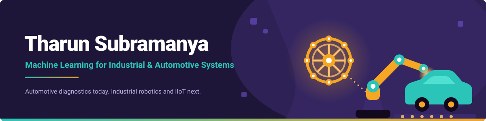

  

 

## 🧭 The Journey

I didn't start in AI. I started in **Industrial & Production Engineering** thinking in tolerances and failure modes, long before I wrote a line of Python. An edge computing course during my Master's changed the trajectory: it introduced me to real-world deployment constraints like latency budgets, sensor noise, compute-at-the-edge trade-offs and I realized that was the actual problem I wanted to work on.

That's the thread connecting everything below: an IoT temperature pipeline on a Raspberry Pi, a serverless digital twin on AWS, and now a full research push into **vehicle diagnostics and predictive maintenance**: brakes, bearings, buzz/squeak/rattle detection. Same question every time: *how do you get a model to tell the truth about a physical system before it fails?*

 

## 🔧 What I'm Building Right Now

<table>
<tr>
<td width="50%" valign="top">

### Smart Brake & Wheel-End Condition Monitor

A physics-first brake diagnostic system, built with a collaborator. My half: a lumped-capacitance rotor thermal simulator (speed-dependent convection/radiation), residual caliper drag-torque injection across four severity levels, dual-wheel FL/FR simulation, and a Newtonian cooling-curve feature extractor that inverts torque from the cooling asymptote. Currently landing within **~5% of ground truth** on severe-drag cases. 18-test suite, CI-gated with `ruff` + `pytest` + coverage.

</td>
<td width="50%" valign="top">

### DARE-PM

*Drift-Aware, Event-Triggered Edge Predictive Maintenance*

Reframed with faculty mentorship as a vehicle BSR (buzz/squeak/rattle) detection system. Core idea: ADWIN drift detection *alone* can't tell you whether a signal shift is a real fault or just a benign environmental change, so I'm building a multi-signal layer (per-feature ADWIN + rolling confidence + cross-sensor majority voting) that resolves that ambiguity before it reaches the controller.

</td>
</tr>
</table>

 

## ⚙️ How I Actually Work

> I default to the next concrete step, not open-ended reflection.
>
> I run multiple learning tracks in parallel: DSA, ML theory, systems design, domain knowledge, rather than sequencing them.
>
> I build domain fluency *alongside* implementation. You can't model brake drag torque well if you don't understand what a caliper is actually doing.

 

## 🧰 Tech I Reach For

**Languages & Data**
 

**Machine Learning & AI**
 

**AI / LLM Tooling**
 

**Data Engineering**
 

**Cloud & Databases**
 

**Hardware / IoT**
 

**Visualization & DevOps**
 

 

## 🚀 Projects Worth a Look

<table>
<tr><th align="left">Project</th><th align="left">What it does</th></tr>
<tr><td><b>Smart Brake &amp; Wheel-End Condition Monitor</b></td><td>Physics-based brake diagnostic system: thermal simulation, drag-torque injection, cooling-curve torque inversion</td></tr>
<tr><td><b>DARE-PM</b></td><td>Drift-aware edge predictive maintenance for vehicle BSR detection: ADWIN with cross-sensor voting</td></tr>
<tr><td><b>IoT Sensing Pipeline</b></td><td>Raspberry Pi + DHT sensors + MQTT (Mosquitto) → Python subscriber → CSV storage → matplotlib visualization</td></tr>
<tr><td><b>Digital Twin + Serverless Alerting</b></td><td>AWS IoT Core + Lambda + SES temperature alert system running on physical Raspberry Pi hardware</td></tr>
</table>

 

## 📍 Right Now, I'm

🔨 Building the Random Forest classifier + diagnostic evidence card for the Smart Brake project

📖 Grinding NeetCode 150, 3Blue1Brown linear algebra, and a self-directed GenAI/LLM track (Hugging Face, LangChain, RAG)

🎯 Filling a flagged SQL gap and pushing further into ETL/Spark

🚗 Learning the language of OEM vehicle diagnostics, one dataset at a time

 

## 💡 Most Importantly

Debugging, implementation, documentation, and editing. That's the job, most days. Not the demo, the ten hours before it.

 

## 📫 Let's Connect

Talk AI, edge computing, or anything with wheels and sensors on it.

 

